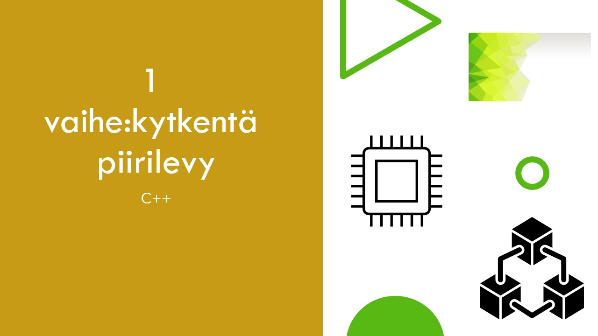
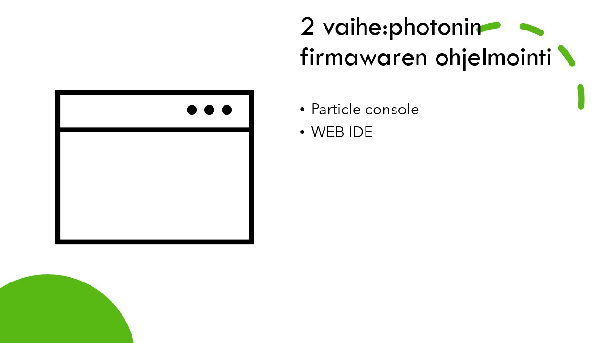
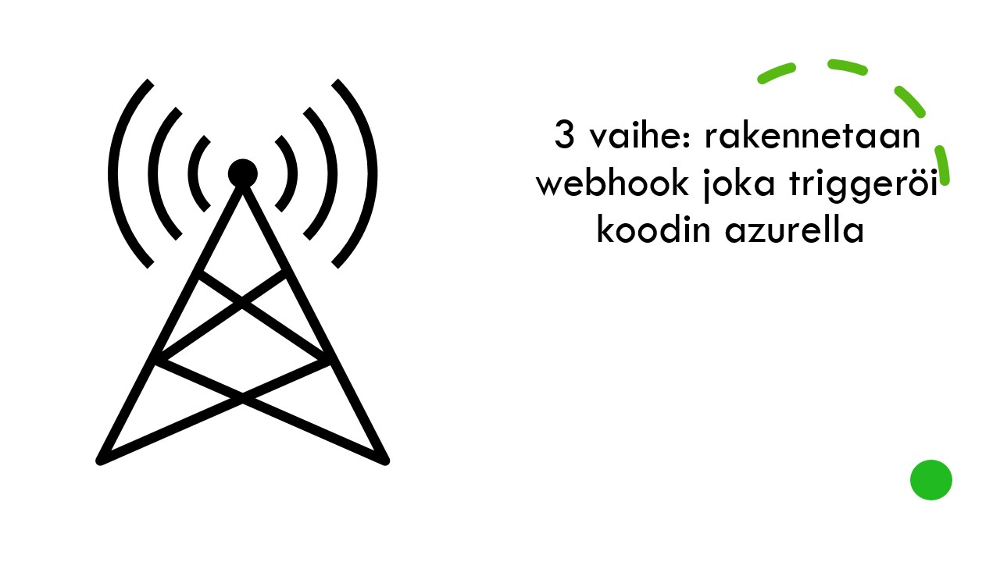
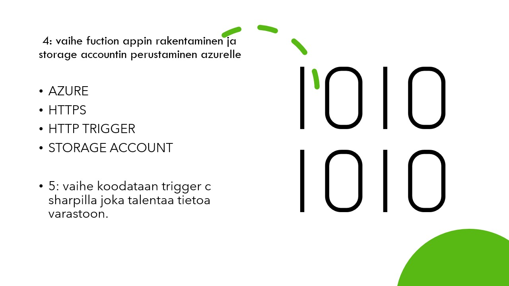
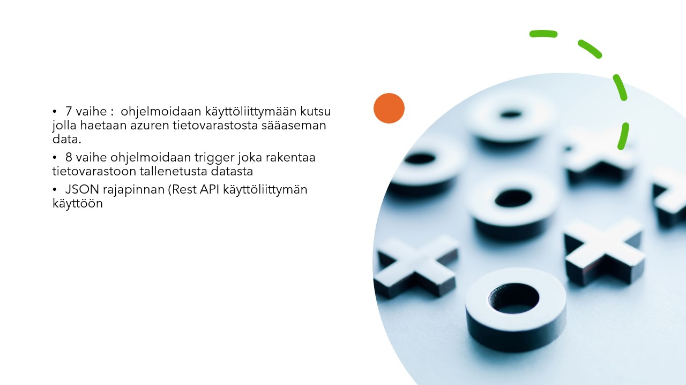
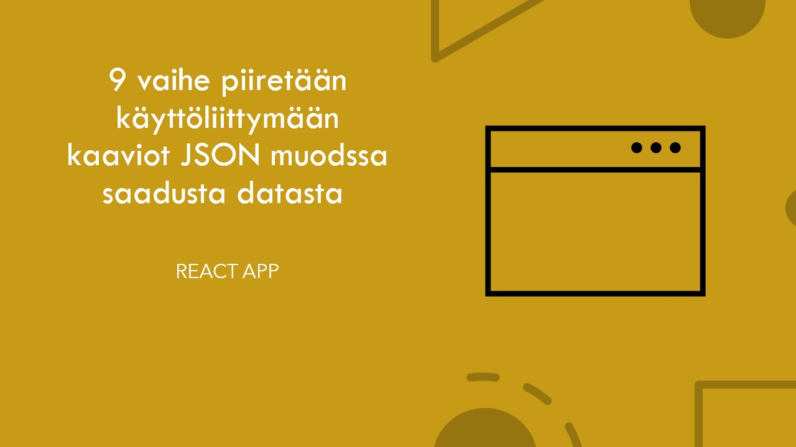

# Iot

# Mikä on Iot?
 -IoT eli (Internet of Things) Esineiden internet
-IoT tarkoittaa järjestelmien, palvelujen ja ohjelmistojen yhteen liittämistä Internetin avulla. Kun reaaliaikaista tietoa analysoidaan automatisoidusti, saadaan enemmän informaatiota päätöksenteon tueksi.
-Laitteista voidaan lukea tietoa tai laitteita voidaan ohjata Internetin yli. Kytkettävä esine voi olla vaikka yksittäinen lämpömittari tai suurempi kokonaisuus kuten ajoneuvo
-Lyhykäisyydessään IoT:n idea on, että laitteisiin ja koneisiin lisätään älyä. 
-Yksinkertaisin esimerkki tällaisesta laitteesta lienee IoT-ranneke eli tutummin aktiivisuusranneke, joka havainnoi käyttäjän liikkeitä ja aktiivisuutta tietyllä aikavälillä. Mikäli ranneke aistii, että käyttäjän aktiivisuustaso on ollut päivän aikana matala, se huomauttaa tästä tärinällä tai helposti huomattavalla valoefektillä. Ranneke kerää kaiken tiedon mobiilisovellukseen, joka on luotu käyttäjälle helposti luettavaksi. Lähde https://www.mpy.fi/yritykset/blogi/mik%C3%A4-ihmeen-iot

- Esineiden Internet on merkittävä sensorimarkkinaa kehittävä voima. Se luo entistä kehittyneimpiä ja monipuolisempia fysikaalisia ja kemiallisia ilmiöitä mittaavia laitteita.
- Älykkäiden sensoreiden merkitys tulevaisuuden palveluprosesseille ja -liiketoiminnalle on aivan keskeinen.

Esimerkki: IoT kiinteistöhallinnassa:
Esineiden internet tarjoaa mahdollisuuden kiinteistön etäseurantaan niin yksityisellä, kuin julkisellakin sektorilla. IoT mahdollistaa esimerkiksi lämpötilan-, kosteuden- tai kulunseurannan.
-lämpötilan tarkkailu 
- päästöt vähenevät
- kulun valvonta 
- toimii hätätilassa 

## Sääasemajärjestelmän toimintakaavio
IoT:n rakenteessa näkyvintä osaa ovat nettiin kytketyt laitteet ja käyttäjän käyttämä sovellus.
- Kuva sääaseman rakenne

1: anturi
2:  tietoliikenne (ethernet, wifi...2g 3g 4g 5g bluetooth rfid nfc 
3 tietovarastot pilvialustat (dataa talennetaan pilvessä  isoimmat tarjojat -(google microsoft)
4 analytiikka - optimointi tarkkailu 

###### Laitteistot
###### Komponentit
 Anturi 

- anturit keräävät ja tuottavat mittausdataa. anturikeräämään tiedon avulla ohjelmoidaan laitteet toimimaan tietyllä tavalla.

tietoliikenne tieto viedään anturilla pilvialustalle. 

 tietovarastot  ja pilvialustat kerätyn datan tallenuspaikka 

analytiikka hyödyntää tallennettua dataa. auttaa yrityksiä tai yksilöitä tekemään oikeita päätöksiä esim  (tehtaan optimoinissa tai  hyvinvoinnin parantamisessa)
- DHT11 - anturia joka mittaa ilman lämpötilaa ja ilmankosteutta.
anturi muuttaa lämpötilan ja ilmankosteuden sähköiseksi suureeksi.
anturit suure viedään piirilevyltä johdinta pitkin particle photon kehityskortille.
anturit ovat nykyään hyvin edullisia sen vuoksi iot kehittyy nopeasti.

- kiihtyvyystunnistus sensori 
- kiihtyvyyssensori
- GPS paikannus anturi
- mikrofoni 
- etäisyyssensori
- kuvasensori
- digitaalinen kompassi
monikosketuksentunnistussensori.

Valaistuksentunnistus

 laitetta voidaan opettaa toimimaan halutulla tavalla.
 digitaalinen mems mikrofoni 
 melu sensori ( esim tiikeri häkissä korkeasaaressa)
  kalibroituja desibeli mittareita
(kaikki data talennetaan)

Äänimittari (melumittari) on käytännöllinen ja hyödyllinen työkalu ihmisille melutasojen havaitsemiseen jokapäiväisessä elämässään. Jos haluat tietää desibelitason ja tehdä äänitestejä, voit välttää altistumisen äänen pilaantumiselle korvien ja kuulon suojaamiseksi
- kuulevia sensoreita 
(verbaalisen aggression tunnistaminen)

Raspberry Pi

- Raspberry Pi yhden piirilevyn minitietokone.  Raspberry Pi on edullisesta hinnastaan huolimatta tehokas ja hyvin laajennettavissa.

Lämpö 

- liike,kosteus,(esim ihmisen mahassa)
- äly pilleri 
- äly laastari 
- äly sensoreita voi myös kauttaa eläimiin.
- myös rahdin seuranta
- puurakennus ( kosteus vaurioiden välttäminen estäminen)
- massanmittaaminen (massavirtauksen mittaaminen)
(liukuhihna)

- kosteus sensoreita voisi käyttää (esim rakennus puolella)

anturit ovat  pieniä (isoin nokia 2110 kokoa) 

 Haju 
IoT haistaa homeen ja nuuhkii päästöt

- laivojen päästöjen mittaus  
- home mittaus 
- keino nenä 
neose prototyyppi tunnistaa 50 hajua  

-  Keinonenän odotetaan tuovan huomattavaa apua erityisesti piilevien ja huonoennusteisten sairauksien, kuten munasarja- ja haimasyövän diagnosoinnissa. Hoitoennuste paranee, kun sairaus löydetään varhaisessa vaiheessa ennen kuin potilas alkaa oireilla.

###### Palvelut
- tietokoneverkko (tai lyhyemmin verkko)
koostuu tietokoneista,jotka on yhdistetty toisiinsa jollakin sellaisella tavlla,että
laitteiden välillä voidaan siirtää tietoa.
protokolla 
on yhdessä sovittu yhteyskäytäntö tai säännöstö, jonka mukaisesti tietokoneet 
vaihtavat tietoa(viestejä) keskenään.

esimerkkejä protokollista 

- TCP-protokolla 
- IP-protokolla 
- HTTP-protokolla
- Signal-protokolla

palvelin on johonkin verkkoon kytketty tietokone,jossa on yksi tai useampi erilainen palvelinohjelma käynnissä.

Internet -palvelut (eli verkkopalvelut)
esimerkkejä
- verkkosivut 
- sosiaaliset mediat 
- pikaviestintäpalvelut (whatsapp ja signal)
- tiedostojen tallenuspalvelut 
- sähköposti
- videotoistopalvelut

pilvipalvelunjentarjoajat 
- ovat yrityksiä jotka vuokraavat (antavat tietojen keräämistävastaan)
kuluttajille ja yrityksille oikeuksia hyödyntää heidän palvelinkeskustensa tietoteknisiä
resurseja ,kuten laskentatehoa ,säilystystilaa tai palvelimien varassa toimiavia verkkopalveluita.

Mitä hyötyjä on pilvipalvelun käytöstä?
- luotettavuus 
- joustavuus

Mitä huonoja puolia on pilvipalvelun käytössä?
- Huonot puolet on, että osa pilvipalveluista maksavat, jonka takia kannattaa valita ennemmin jokin muu tallennus keino.

- Pilvipalveluissa on myös riski, että tietoja häviää esimerkiksi tietomurron seurauksena. On myös annettu kritiikkiä, että palvelun omistajat pystyvät tarkastelemaan käyttäjien tallentamaa tietoa.

###### Ohjelmointi
###### Toiminta

# Käytetyt kehitysympäristöt
# Termihakemisto
# Viitteet
