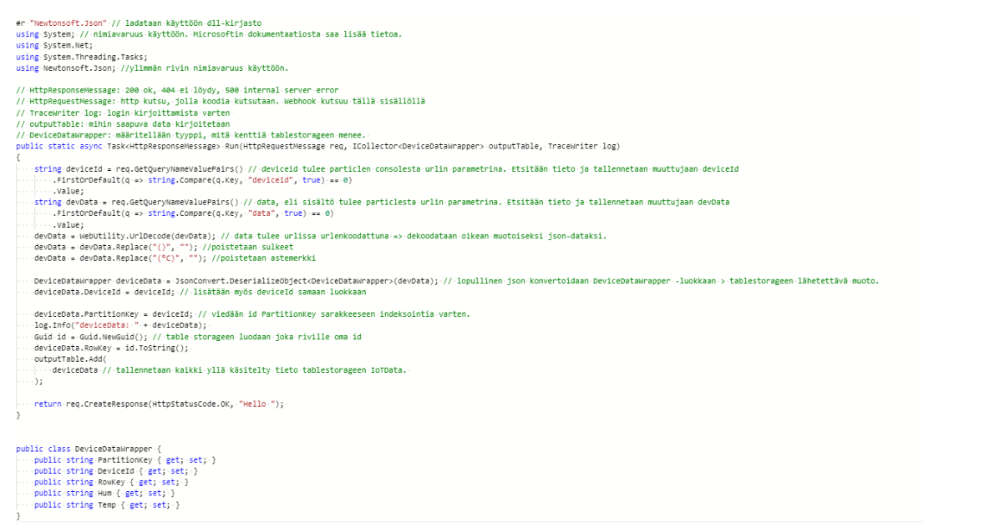
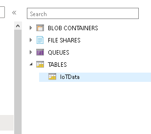
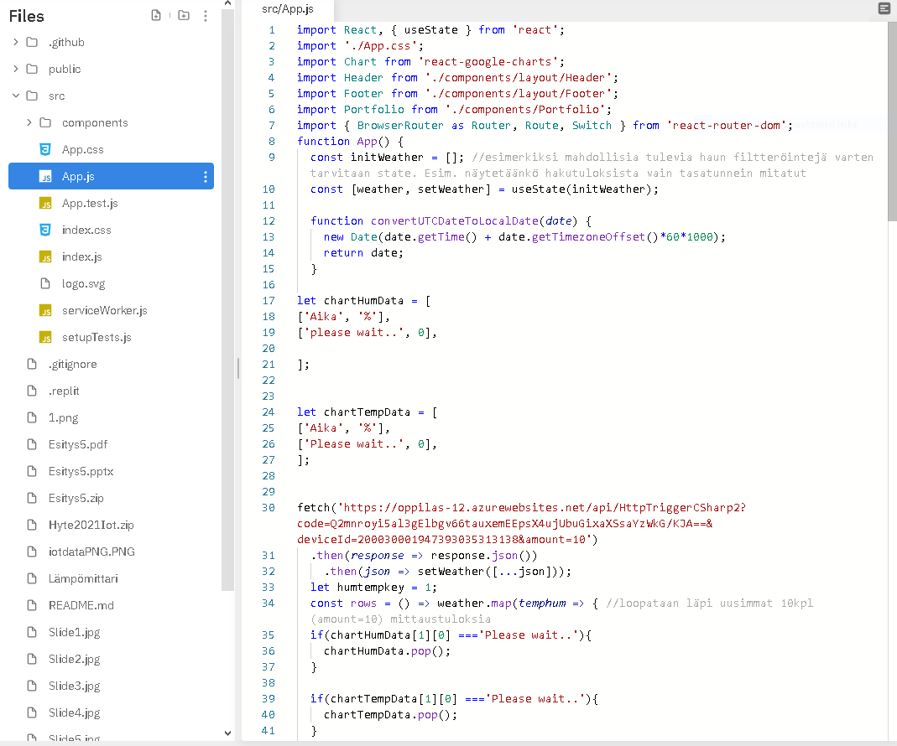
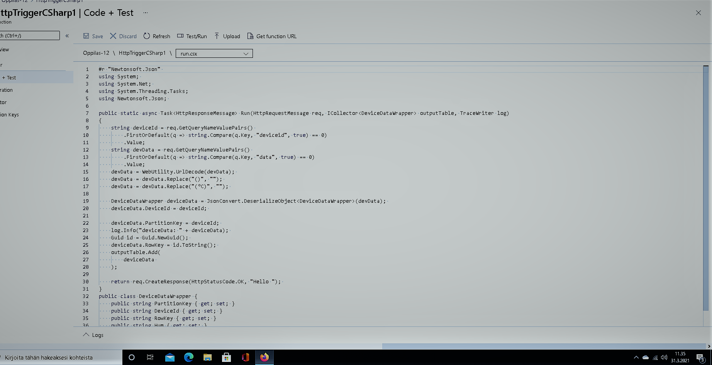
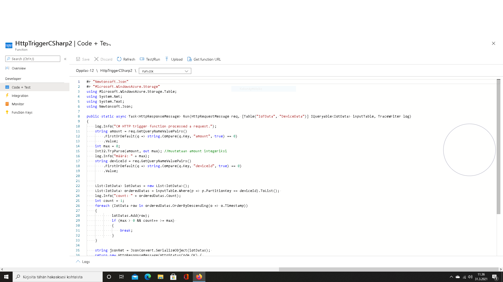
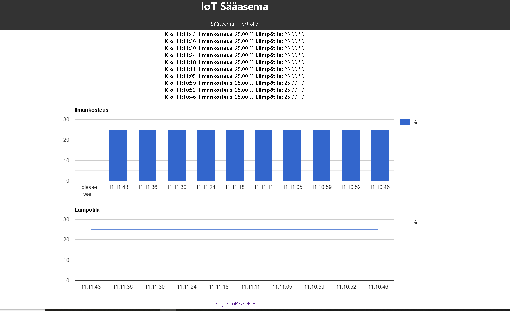

# Iot

# Mikä on Iot?
 -IoT eli (Internet of Things) Esineiden internet
-IoT tarkoittaa järjestelmien, palvelujen ja ohjelmistojen yhteen liittämistä Internetin avulla. Kun reaaliaikaista tietoa analysoidaan automatisoidusti, saadaan enemmän informaatiota päätöksenteon tueksi.
-Laitteista voidaan lukea tietoa tai laitteita voidaan ohjata Internetin yli. Kytkettävä esine voi olla vaikka yksittäinen lämpömittari tai suurempi kokonaisuus kuten ajoneuvo
-Lyhykäisyydessään IoT:n idea on, että laitteisiin ja koneisiin lisätään älyä. 
-Yksinkertaisin esimerkki tällaisesta laitteesta lienee IoT-ranneke eli tutummin aktiivisuusranneke, joka havainnoi käyttäjän liikkeitä ja aktiivisuutta tietyllä aikavälillä. Mikäli ranneke aistii, että käyttäjän aktiivisuustaso on ollut päivän aikana matala, se huomauttaa tästä tärinällä tai helposti huomattavalla valoefektillä. Ranneke kerää kaiken tiedon mobiilisovellukseen, joka on luotu käyttäjälle helposti luettavaksi. Lähde https://www.mpy.fi/yritykset/blogi/mik%C3%A4-ihmeen-iot

- Esineiden Internet on merkittävä sensorimarkkinaa kehittävä voima. Se luo entistä kehittyneimpiä ja monipuolisempia fysikaalisia ja kemiallisia ilmiöitä mittaavia laitteita.
- Älykkäiden sensoreiden merkitys tulevaisuuden palveluprosesseille ja -liiketoiminnalle on aivan keskeinen.

Esimerkki: IoT kiinteistöhallinnassa:
Esineiden internet tarjoaa mahdollisuuden kiinteistön etäseurantaan niin yksityisellä, kuin julkisellakin sektorilla. IoT mahdollistaa esimerkiksi lämpötilan-, kosteuden- tai kulunseurannan.
-lämpötilan tarkkailu 
- päästöt vähenevät
- kulun valvonta 
- toimii hätätilassa 

## Sääasemajärjestelmän toimintakaavio
IoT:n rakenteessa näkyvintä osaa ovat nettiin kytketyt laitteet ja käyttäjän käyttämä sovellus.
- Kuva sääaseman rakenne

1: anturi
2:  tietoliikenne (ethernet, wifi...2g 3g 4g 5g bluetooth rfid nfc 
3 tietovarastot pilvialustat (dataa talennetaan pilvessä  isoimmat tarjojat -(google microsoft)
4 analytiikka - optimointi tarkkailu 

###### Laitteistot

Laitteisto:
Particle Photon IoT KEHITYSKORTTI

  - Particle P Wi-Fi module
   - Broadcom BCM43362 Wi-Fi chip
   - 802.11b/g/n Wi-Fi     
   - STM32F205RGY6 120Mhz ARM Cortex M3
    - 1MB flash, 128KB RAM
   - On-board chip antenna (external antenna IPEX U.FL optional)
    - On-board RGB status LED (ext. drive provided)
    - 18 Mixed-signal GPIO and advanced peripherals
    - Open source design
    - Real-time operating system (FreeRTOS)
    - Soft AP setup
    - FCC, CE ja IC certified

- particle Photon- kehityskortti vastaanottaa sähköiseen suuren ja muuttaa sen digitaaliseen muotoon.
- koodajaan ohjelmoimaan Firmware (laitteistoohjelma) koodin ansiosta kehityskortin prosessi osaa kirjoittaa saamansa tiedon asteina ja prosentteina konsolin ja lähettää datan webhookilla eteenpäin.

- particle photonin laiteohjelmisto kirjoitetaan web Idellä (intergrated devolopment environment)

- kalibrointi anturin mittauksen tarkkuuden ja luotettavuuden varmistamiseen
verrataan kalibroitavan anturin antamaan luomaan referenssi anturiin.

arduino :
- ohjelmoitava 8 bittinen mikroprosessori 
ohjelmointi tapahtuu arduino iden avulla
- perusharrastajan alusta 
levylle mahdollista liittää lisälevyjä eli shieldejä.
pinneihin voi hyppylangoilla kiinnittää myös anturielementtejä tai muita elektronisia osia.

Micro: bit 

- ohjelmointii ja pienten elektroniikkaprojektien harjoitteluun 
suorittimen ARM Cortex m0 cpu 
- 25 ohjelmoitavaa lediä
- 2 ohjelmoitavaa painonappia 
- valo- lämpötila anturi 
liike anturi ( kiihtyvyysmittari ja kompassi)
langattomat yhteyden radion ja bluetoothin avulla 
liitäntäpinnejä.

Ruuvitaq
- avoimen lähdekoodin anturialusta 
- Bluetooth 
- Lämpötila
- ilman suhteellinen kosteus 
- ilman paine
- kiihtyvyys 

MultiSensor 6:
- ei prosessoria 
- z Wawe gateway 
- liiketunnistin 
- lämpötila 
- valoanturi 
- kosteusanturi 
- Tärinäanturi 
- UV anturi 

LAITEOHJELMISTO
- lataa laitteen koodin tarvittavat kirjastot:

- ohjelmoi laite:

###### Komponentit
 Anturi:

- anturit keräävät ja tuottavat mittausdataa. anturikeräämään tiedon avulla ohjelmoidaan laitteet toimimaan tietyllä tavalla.

tietoliikenne tieto viedään anturilla pilvialustalle. 

 tietovarastot  ja pilvialustat kerätyn datan tallenuspaikka 

analytiikka hyödyntää tallennettua dataa. auttaa yrityksiä tai yksilöitä tekemään oikeita päätöksiä esim  (tehtaan optimoinissa tai  hyvinvoinnin parantamisessa)

- kiihtyvyystunnistus sensori 
- kiihtyvyyssensori
- GPS paikannus anturi
- mikrofoni 
- etäisyyssensori
- kuvasensori
- digitaalinen kompassi
monikosketuksentunnistussensori.

Valaistuksentunnistus

 laitetta voidaan opettaa toimimaan halutulla tavalla.
 digitaalinen mems mikrofoni 
 melu sensori ( esim tiikeri häkissä korkeasaaressa)
  kalibroituja desibeli mittareita
(kaikki data talennetaan)

Äänimittari (melumittari) on käytännöllinen ja hyödyllinen työkalu ihmisille melutasojen havaitsemiseen jokapäiväisessä elämässään. Jos haluat tietää desibelitason ja tehdä äänitestejä, voit välttää altistumisen äänen pilaantumiselle korvien ja kuulon suojaamiseksi
- kuulevia sensoreita 
(verbaalisen aggression tunnistaminen)

Raspberry Pi

- Raspberry Pi yhden piirilevyn minitietokone.  Raspberry Pi on edullisesta hinnastaan huolimatta tehokas ja hyvin laajennettavissa.

Lämpö:

- liike,kosteus,(esim ihmisen mahassa)
- äly pilleri 
Älypilleri paikantaa sijaintinsa suolessa mittaamalla ympäristön paikallisen happamuuden. Suolessa happamuus vaihtelee hyvin paljon paikallisesti, joten pillerin sijainti voidaan määrittää tarkasti. 
- äly laastari 
Älylaastari laitetaan iholle kuten normaali laastari, mutta haavatyynynä toimivaan nanosellupohjaiseen hydrogeeliin voidaan lisätä lääkeainetta, joka vapautuu elimistöön vähitellen hoitaen vammaa. Laastarissa on mukana myös sähköisiä antureita, jotka antavat tietoa haavan paranemisesta.

Esimerkiksi diabeetikoilla tai palovammapotilailla voi olla isoja ja hitaasti paranevia haavoja ihollaan. Tällaisten haavojen siteitä joudutaan vaihtamaan jopa päivittäin. Itse haavan paraneminen ei sitä välttämättä edellytä, vaan on vain päästävä tarkastamaan, onko haava esimerkiksi tulehtumassa. Kun paranemista seurataan elektrodien avulla, ei siteitä tarkastuksen takia tarvitse avata.

- äly sensoreita voi myös kauttaa eläimiin.
- Rahdin seuranta
- puurakennus ( kosteus vaurioiden välttäminen estäminen)
- massanmittaaminen (massavirtauksen mittaaminen)
(liukuhihna)

- kosteus sensoreita voisi käyttää (esim rakennus puolella)

anturit ovat  pieniä (isoin nokia 2110 kokoa) 

 Haju:

- laivojen päästöjen mittaus  
- home mittaus 
- keino nenä 
neose prototyyppi tunnistaa 50 hajua  

-  Keinonenän odotetaan tuovan huomattavaa apua erityisesti piilevien ja huonoennusteisten sairauksien, kuten munasarja- ja haimasyövän diagnosoinnissa. Hoitoennuste paranee, kun sairaus löydetään varhaisessa vaiheessa ennen kuin potilas alkaa oireilla.

- Navidiumin kehittämän teknologian avulla laivat pystyvät valitsemaan optimaalisen reitin reaaliaikaisten olosuhdetietojen ja ennusteiden mukaan. Tosiaikaista tietoa säistä, jäistä, tuulista ja merivirroista virtaa Navidiumin järjestelmään kymmenistä tuhansista havaintopisteistä eri puolilta maailmaa.
- Olipa reitti mikä tahansa, polttoaineen kulutus vähenee joka tapauksessa Navidiumin kehittämän optimointiratkaisun avulla. Ulkopuolisten olosuhteiden huomioimisen lisäksi sen IoT-toteutus tarkkailee laivan moottorin ja voimansiirron toimintaa jopa satojen sensoreiden ja virtausmittareiden voimin.

- Navidiumin kehittämät algoritmit tekevät laskelmia, joista ihmisaivot eivät suoriutuisi. Ne antavat toimintaohjeitaan analysoimansa datan perusteella. Ulkoisia olosuhdetietoja ja IoT-dataa tulee yhtiön järjestelmään joka sekunti lisää. Sitä on siis paljon – ja koko ajan enemmän.

Näkö:
- konenäkö pullonpalautus sensori (kognitiivinen konenäkö)
- robotti imuri ( voi ohjailla puhelimella)
- infrapuna 

Tehokkuus
Konenäkö pystyy havainnoimaan useita ominaisuuksia samanaikaisesti ja tekemään nopeita päätöksiä havaintojen perusteella.

Parempi laatu
Kone on ihmistä tarkempi ja nopeampi havaitsemaan laatupoikkeamia. Laatua voidaan valvoa ympäri vuorokauden.

 - Näkeviä sensoreita on paljon esimerkiksi toimistoissa: liiketunnistin sytyttää valot ja kertoo tarvittaessa hälytysliikkeelle, onko tiloissa tunkeutuja. Niillä tutkitaan myös esimerkiksi rahtikontin täyttöastetta.

- Konenäkö pyrkii automatisoimaan tehtäviä, jotka perustuvat näkemiseen. Järjestelmä rakentuu kamerasta ja tietokoneesta, joka analysoi kuvia tai videokuvaa. Konenäön avulla pyritään sekä näkemään että ymmärtämään näkymää. Järjestelmä auttaa tunnistamaan esineitä, ihmisiä tai toimintaa. Tunnistamisessa käytetään apuna tekoälyä ja koneoppimista, joiden avulla järjestelmä voidaan opettaa tunnistamaan haluttuja asioita kuvasta.

DHT-11  anturi
- DHT-11: tä käytetään lämpötilan ja kosteuden mittaamiseen. Tämä Arduinon lämpötila-anturi on suosituin sen hinnan ja ominaisuuksien takia
- Se tarjoaa luotettavan tuotannon tulokset, kun ympäristön kosteus vaihtelevat 20% - RH 90% RH ja lämpötila-alue 0 ° C-50 ° C
- anturi muuttaa lämpötilan ja ilmankosteuden sähköiseksi suureeksi.
- anturin suure viedään piirilevyltä johdinta pitkin particle photon kehityskortille.
- anturit ovat nykyään hyvin edullisia sen vuoksi iot kehittyy nopeasti.

###### Palvelut
- tietokoneverkko (tai lyhyemmin verkko)
koostuu tietokoneista,jotka on yhdistetty toisiinsa jollakin sellaisella tavlla,että
laitteiden välillä voidaan siirtää tietoa.
protokolla 
on yhdessä sovittu yhteyskäytäntö tai säännöstö, jonka mukaisesti tietokoneet 
vaihtavat tietoa(viestejä) keskenään.

esimerkkejä protokollista 

- TCP-protokolla 
- IP-protokolla 
- HTTP-protokolla
- Signal-protokolla

palvelin on johonkin verkkoon kytketty tietokone,jossa on yksi tai useampi erilainen palvelinohjelma käynnissä.

Internet -palvelut (eli verkkopalvelut)
esimerkkejä
- verkkosivut 
- sosiaaliset mediat 
- pikaviestintäpalvelut (whatsapp ja signal)
- tiedostojen tallenuspalvelut 
- sähköposti
- videotoistopalvelut

pilvipalvelunjentarjoajat 
- ovat yrityksiä jotka vuokraavat (antavat tietojen keräämistävastaan)
kuluttajille ja yrityksille oikeuksia hyödyntää heidän palvelinkeskustensa tietoteknisiä
resurseja ,kuten laskentatehoa ,säilystystilaa tai palvelimien varassa toimiavia verkkopalveluita.

Mitä hyötyjä on pilvipalvelun käytöstä?
- luotettavuus 
- joustavuus

Mitä huonoja puolia on pilvipalvelun käytössä?
- Huonot puolet on, että osa pilvipalveluista maksavat, jonka takia kannattaa valita ennemmin jokin muu tallennus keino.

- Pilvipalveluissa on myös riski, että tietoja häviää esimerkiksi tietomurron seurauksena. On myös annettu kritiikkiä, että palvelun omistajat pystyvät tarkastelemaan käyttäjien tallentamaa tietoa.

###### Ohjelmointi
###### Toiminta

# Käytetyt kehitysympäristöt
- repl.it 
- azure 
- versionhallinta 
- particle pilvipalvelu 
- PilviPalvelu MS Azure 

- Particle Photonin konsolista tehdään Webhookkutsu Azurentriggerille aina kun uusi mittaustulos saadaan. Mittausväli asetetaan laiteohjelmistossa loopindelay-ajalla.
Trigger tallentaa Webhookilla tulleen datan Tablestorageen pilvipalvelussa. 

- Trigger tallentaa Webhookilla tulleen datan Tablestorageen pilvipalvelussa. Tablestorageen lähetetään mittaustiedon lisäksi myös laitteen id tieto.

Käyttöliittymä:

- Käyttöliittymä tehtiin Reactilla. Ohjelmointiympäristönä voi käyttää esim. Visual Studio Code–ohjelmaa, tai netissä toimivaa Replit.com –palvelua. React kutsuu Azurella toista triggeriä,joka rakentaa Tablestoragentiedoista JSON rajapinnan (REST API) pyydetyillä parametreilla. Trigger-koodi pystyy tällä hetkellä käsittelemään laitteen id (deviceId) ja mittaustulosmäärä (amount) parametrit. Parametrit lähetetään triggerkutsun URL:ssa.
- Uusimmistamittaustuloksista piirretään Google chartspalvelua käyttäen kaaviot ilmankosteudesta sekä lämpötilasta.
 - Koodit siirretään versionhallintajärjestelmään. Tässä tapauksessa käytetiin Github–palvelua. 
- Github–palvelusta tehdään ci/cd (=continuousintegration/ continuousdeployment) pipeline Azurelle,jossakäyttöliittymä julkaistaan StaticWeb App palveluna. Näin versionhallintaan siirretty käyttöliittymäkoodi päivittyy automaattisesti tuotantopalvelimelle ja on heti selaimella käytettävissä.
- Projektia kehitetään lyhyinä sprintteinä, eli pienet muutokset siirretään testattavaksi ja koodia muokataan joustavasti ja skaalautuvasti tarpeen mukaan. 

triggercsharp1

tallentaa  dataa 

triggercsharp2

hakee dataa tietokannasta  

# Termihakemisto
Mikä on API
- API on lyhenne sanoista application programming interface, eli ohjelmointirajapinta ja tarkoittaa samaa kuin rajapinta. Eli jos joku alkaa selostamaan sinulle jotain apista, niin nyt ymmärrät, että kyse on ohjelmiston ohjelmointirajapinnasta.

- Versionhallinta tarkoittaa menetelmiä, joilla tiedostoista (tai muista tietovarastoista) pidetään muistissa, millaisia ne ovat olleet missäkin vaiheessa, kuka niitä on muuttanut, milloin ja miten (sekä usein vapaamuotoisia kuvauksia siitä, miksi). Toisin päin versionhallinta kertoo tiedostoista (tai muista tietovarastoista), miten ne ovat muodostuneet, mikä niissä on kenenkin tekemää ja mitä muutoksia ne sisältävät. 

# Viitteet
LÄHDELUETTELO
- Collin, J. & Saarelainen, A. (2016).Teollinen internet (e-kirja).Helsinki: Talentum

- Derler, Z. (6.6.2020). Smart street lighting will help future-proof our cities. [blogikirjoitus]. Haettu osoitteesta https://www.signify.com/global/our-company/blog/innovation/smart-street-lighting-will-help-future-proof-cities
- Gynther, R & Avovaara, A. (käsikirjoittajat). [LAB Focus]. (27.8.2020). Mitä IoTon | IoT-osaamisloikka 1 [video]. Haettu osoitteesta https://youtu.be/BK06TQA_ygY?list=PLtbOrywM-BA8qzTn5fkzhlcaR3d92HYO7

- Lantta, E. & Vahto, A. (käsikirjoittajat). [LAB Focus]. (27.8.2020). IoTjärjestelmärakenne || IoT-osaamisloikka 2 [video]. Haettu osoitteesta https://youtu.be/2p7V_6WzVOw?list=PLtbOrywM-BA8qzTn5fkzhlcaR3d92HYO7

- Lähde https://www.mpy.fi/yritykset/blogi/mik%C3%A4-ihmeen-iot